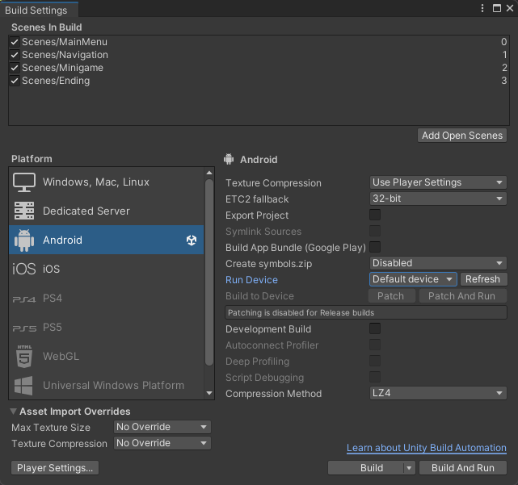

# The Campus Case

_A Route Finders project_

## Setting Up

### Computer Side

1. Clone this repo.
2. Install [Unity Hub](https://unity.com/unity-hub) and log in.
3. Open this project from the projects tab.
4. Install the required Unity version (`2022.3.11f1`).
5. Install [JetBrains Rider](https://www.jetbrains.com/rider/), [Visual Studio](https://visualstudio.microsoft.com#vs-section) or [VSCode](https://visualstudio.microsoft.com#vscode-section).

### Phone Side

1. Install the Unity Remote 5 app:
   - Link for [Android](https://play.google.com/store/apps/details?id=com.unity3d.mobileremote).
   - Link for [iOS](https://apps.apple.com/us/app/unity-remote-5/id871767552).
2. Enable USB debugging.

## Running in the editor

1. Have the Unity Remote 5 app open on your phone, connected by USB cable.
2. Press the play button in the top-bar of Unity. The game should be running in both the editor and on your phone. The game should show on your mobile device.
3. Test the game on your phone. Any AR sections however should be played in the editor, as Unity Remote 5 does not support AR testing.
4. To move around in AR in the editor, use the following controls **while having the right-mouse button pressed**:
    - Move the mouse to look around.
    - WASD to move around.
    - Q and E to move up and down.

## Building

### Android

1. Use `Ctrl` + `Shift` + `B` to open up the build menu.
2. Configure it for your device: 
3. Click the `Build` button
4. Specify the location of the `.apk` file to be saved. You will need to transfer this to your phone, so remember where it is.
5. Transfer the `.apk` file to your phone.
6. On your phone, open the `.apk` file and install it. If any popups come up asking for permissions, grant them.

### iOS

`To be added`
